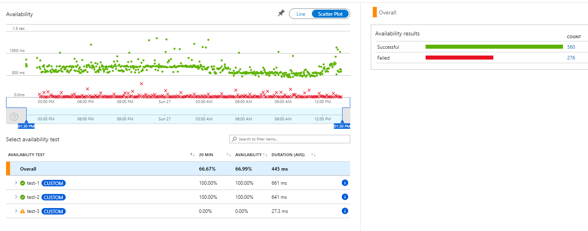
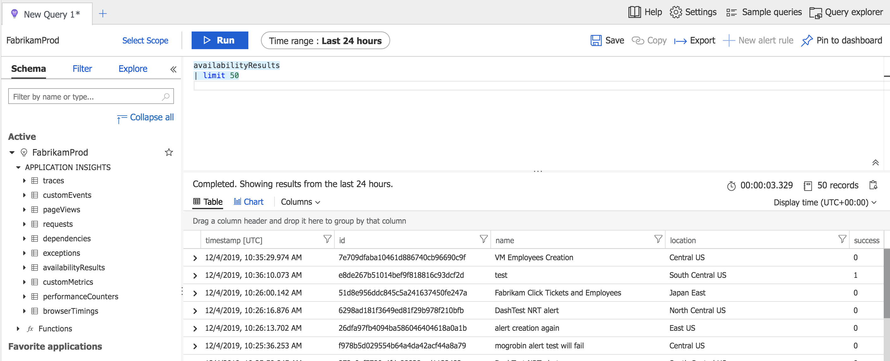
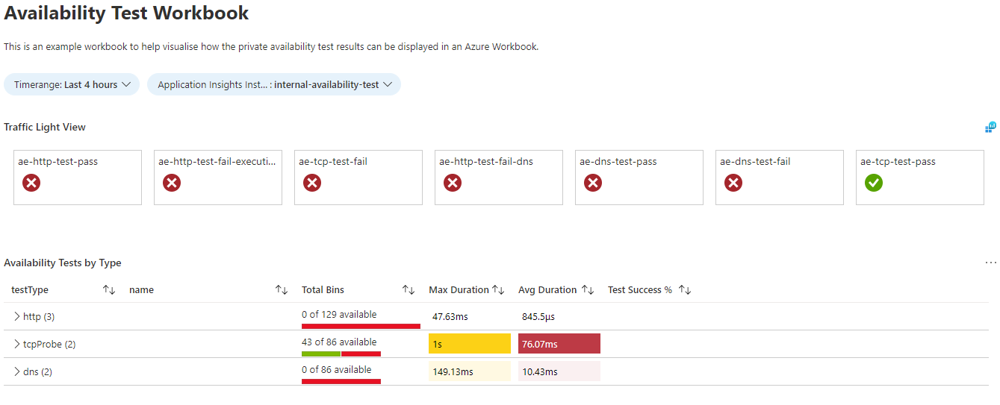

# Private Availability Tests - Azure App Insights

The code within this repository will execute private availability tests and publish the logs to Azure Application Insights in the `Availability` panel. This is effectively synthetic checks for internal and external addresses. By default Application Insights Availability tests can only test publicly accessible endpoints. It also can't perform advanced authentication (e.g. oauth2) or test DNS records.

## Usage

To use this repository, provision the code into an Azure function. To test privately addressable resources in Azure or on-premises, you will need to ensure the network the Azure function is provisioned to has connectivity to those resources. As well as using a Premium App Service plan. As the other SKU's don't support provisioning a function into an internal vNet.

> **Note:** A premium function app with vNet integration enabled requires a dedicated subnet. So plan accordingly.

## Availability Test Results

The results from this test are available in the `Availability` panel for the Application Insights attached to the function app executing this script.



The data can also be queried through the Log Analytics workspace.



## PreRequisites

As PowerShell core doesn't have any native DNS modules, an additional module is required to perform DNS lookups. So if you enabled the DNS tests, you need to install this [module](https://github.com/rmbolger/DnsClient-PS).

## Use Cases

The availability tests can be written to perform custom assessments against your workloads. Use the code in this repository as a rough example for three use cases:

### 1: Testing if an internal HTTP(s) server is responding to requests

- Test connectivity between Azure and on-premises web servers (dependencies for solutions running in Azure).
- Measure latency over the express route on these requests.
- Write advanced availability tests (oauth2) or multi-step validation on results.

### 2: Verify if internal servers are still accessible

- Test if jumpboxes / bastions are still available for SSH or RDP connections.
- Confirm on-premises servers have the appropriate ports open and accessible (verifies NSG, Firewalls and such are configured).

#### 3: Test DNS query results

- Test if DNS servers are able to resolve key DNS queries.

## Results

The results of these tests can be used a data source in an Azure Workbook for a traffic light (green, orange and red) view of your core Azure

## Json Tests File

The tests are added into the `monitoring.json` file. The script reads this file then loops through each test.

*HTTP(s) Tests*:

```json
{
    "testType": "http",
    "tests": [
        {
            "name": "http-test-1",
            "address": "https://bing.com"
        },
        {
            "name": "http-test-2",
            "address": "https://bing.com",
            "proxyAddress": "https://proxyaddress:port"
        }
    ]
}
```

*TCP Probe Tests*:

```json
{
    "testType": "tcpProbe",
    "tests": [
        {
            "name": "tcp-test-1",
            "address": "localhost",
            "port": 22
        }
    ]
}
```

*DNS Tests*:

```json
{
    "testType": "dns",
    "tests": [
        {
            "name": "dns-test-1",
            "address": "8.8.8.8",
            "dnsRecord": "bing.com"
        }
    ]
}
```

> **Note:** If you don't need a certain test type, leave the array empty.

## Deployment

To use the code in this repository you need to:

1. Deploy an Azure Function App that is vNet integrated (so it needs to run on a Premium App Service Plan).
2. Update the `requirements.psd1` with the content of the file in this repository.
3. Create a `Timer` based function on the new Function app, that uses the language `PowerShell Core` (version 7+).
4. Upload the `monitoring.json` file along with the `monitoring.ps1` to the Azure function app.

<!-- To simplify running a Proof Of Concept for this code the `deployment` directory contains Bicep modules can can be used to deploy the entire stack end-to-end. -->

## Workbook

To help visualize how this data can be used, this repository containers an Azure Workbook (`workbook.json`).



## Limitations

- The frequency will be controlled via the function apps timer trigger, not within the individual tests.
- Azure Functions used PowerShell Core which doesn't have a native DNS resolution tool. So to perform DNS queries you need to include the package [DnsClient-PS](https://github.com/rmbolger/DnsClient-PS). This is already included in the dependencies.json file. This file is used by the function to determine any packages to install when the function starts.

## Documentation

- [Availability Azure Functions](https://docs.microsoft.com/en-us/azure/azure-monitor/app/availability-azure-functions)
